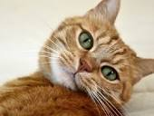

# styletransfer

Implementation of the paper [A Neural Algorithm of Artistic Style](https://arxiv.org/abs/1508.06576). \
Added [Total Variation loss](https://arxiv.org/abs/1412.0035) which was not implemented in the original paper.

| Content | Style | Result |
| :-----: |:-----:| :-----:|
|  |  |  |
|  |  |  |

<br/>

To transfer the style of an image, run the following commands:

```bash
./main.py cat.jpg matisse.jpg
```

Gif can also be created by running create_gif.py
